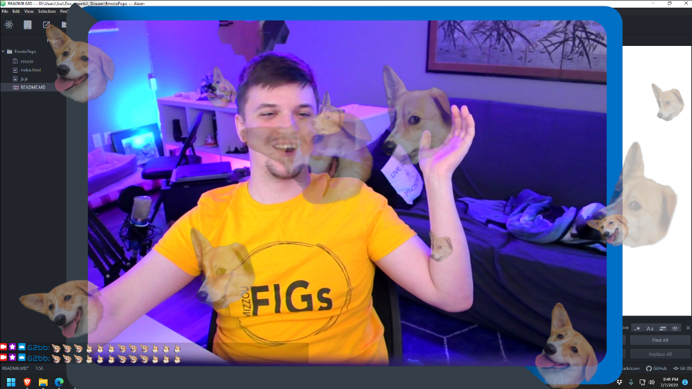

# EmotePops
EmotePops is a lightweight browser source to display emotes on your Twitch streams!
 

## Description
EmotePops is a lightweight browser source to display emotes on your Twitch streams! Emotes will appear automatically from your Twitch Chat at a random position, scale, and rotation, on your Twitch Stream. Great care has been taken to ensure your emotes appear fully on the screen so you don't lose any art to the edge of the screen!

## Hosted Version
This is by far the easiest way to get up and running with EmotePops!
1. Add a browser source in OBS to 'https://g2bb.github.io/hosted.html?TWITCH_USERNAME'
2. Enjoy your EmotePops!

## Local Installation
You can install locally to avoid server downtime.
1. Download this repository
2. Extract `index.html` to a destination you will remember
3. Open the file and update the `channel` const in the script section with your channel name
4. Add a browser source in OBS
    1. Tick the box next to "Local file"
    2. Click "Browse" and select `index.html`
5. Enjoy your EmotePops

## Self-Hosted Web Installation
Self-Host this overlay on your own server.
1. Download this repository
2. Extract `hosted.html` to a destination you will remember
3. Move it to your Webhost and change the name to `index.html`
4. Add a browser source in OBS to `https://YOURHOST.TLD?TWITCH_USERNAME`
5. Enjoy your EmotePops

## To Do
- [x] Webserver Version
- [X] Hosted Version
- [ ] BetterTwitchTV Integration
- [ ] Youtube Integration
- [ ] FrankerfaceZ Integration

---
Created with ❤️ by [G2bb](https://twitch.tv/g2bb) - Huge thanks to [Instafluff](https://github.com/instafluff/) for [ComfyJS](https://github.com/instafluff/ComfyJS)
